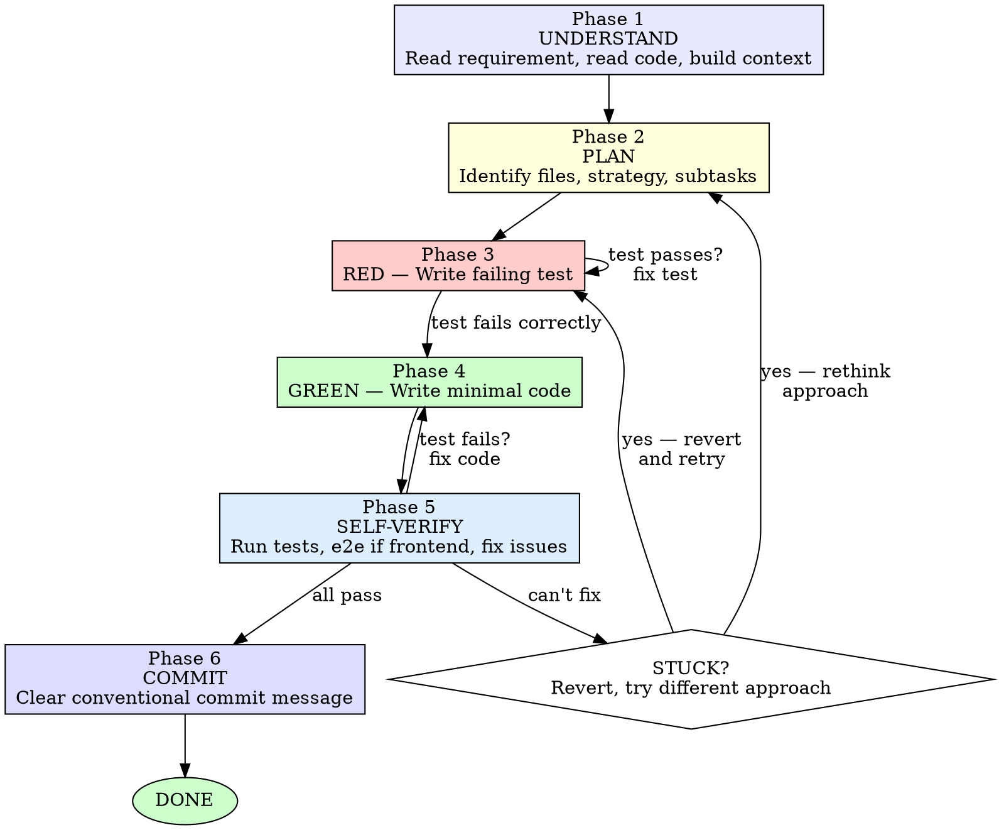

# Implementing Code (Coding Agent SOP)

## Overview

The master workflow for turning a requirement into working, verified, committed code. Every step exists for a hard-won reason. Skip none.

**Core principle:** Converge toward Done in the shortest possible path. Understand before acting. Test before implementing. Verify before claiming. Commit clean.

**Violating any step of this workflow is violating the entire workflow.**

## The Iron Law

```
NO CODE WITHOUT UNDERSTANDING THE CONTEXT FIRST.
NO IMPLEMENTATION WITHOUT A FAILING TEST FIRST.
NO COMPLETION CLAIM WITHOUT FRESH VERIFICATION.
```

## When to Use

**Always — every feature, bugfix, refactor, or code change.**

This is the master SOP. There is no "just a quick fix" exception. The workflow scales down for trivial changes (you still understand, test, verify, commit) and scales up for complex features.

## The Implementation Loop



---

## Phase 1: Understand

### 1a. Parse the Requirement

Read the task, spec, or issue. Identify:
- What is the exact behavior change?
- What are the boundaries (what is explicitly NOT in scope)?
- Are there acceptance criteria or edge cases listed?

Do not proceed until you can state the requirement in one sentence.

### 1b. Read the Relevant Codebase Context

**You reason best about code you've actually read.** Before touching any file:

- Read the files that will be modified. Read them completely — not just the function signature.
- Read adjacent code that calls or is called by the target code.
- Read existing tests in the same area to understand test patterns and utilities.
- Identify conventions: naming, file structure, error handling, types, imports.

**Why this matters:** Agents that skip this phase produce code that fights the codebase — wrong patterns, duplicate utilities, broken assumptions. Reading first prevents rework.

### 1c. Build Your Mental Model

From what you've read, answer:
- What data flows through this code? Where does it come from, where does it go?
- What are the invariants (things that must always be true)?
- What patterns does the codebase use for similar features?

If you can't answer these, you haven't read enough. Go back to 1b.

---

## Phase 2: Plan

### 2a. Identify What Changes

List exactly:
- Which files to create
- Which files to modify (with line ranges if known)
- Which test files to create or modify

### 2b. For Complex Changes: Write a Brief Spec

If the change touches 3+ files or introduces a new concept, write a short inline spec covering:
- The problem (one sentence)
- The approach (2-3 sentences)
- The files touched and what changes in each
- Edge cases to handle

This is not a full design document — it's a scaffold that prevents drift. Write it in a comment or scratch file, not a committed doc, unless the user requests otherwise.

### 2c. Identify Test Strategy

For each behavior change:
- What is the simplest test that proves it works?
- Are there existing test utilities or fixtures to reuse?
- Is this a frontend change? If yes: `e2e-self-verification` will apply after implementation.

---

## Phase 3: RED — Write the Failing Test

**REQUIRED SUB-SKILL:** Follow `test-driven-development` for the full RED-GREEN-REFACTOR cycle.

Write one minimal test that:
- Tests one behavior
- Has a clear, descriptive name
- Uses existing test utilities and patterns
- Tests real code, not mocks (unless unavoidable)

Then **watch it fail:**

```bash
# Run the specific test — confirm it FAILS for the expected reason
npm test -- path/to/testfile --testNamePattern="test name"
# or: pytest tests/path/test_file.py::test_name -v
```

**Test passes?** You're testing existing behavior, not the new feature. Fix the test.

**Test errors (not fails)?** Fix the test syntax/fixtures until it fails correctly — because the feature is missing, not because of a typo.

---

## Phase 4: GREEN — Write Minimal Code

**Write the simplest code that makes the test pass.**

Rules:
- No features beyond what the test demands (YAGNI)
- No refactoring adjacent code
- No "while I'm here" improvements
- No error handling for scenarios that can't happen
- No docstrings or comments unless the logic is non-obvious
- Follow existing codebase conventions exactly

Run the test again:

```bash
# Confirm: test PASSES, no other tests broken
npm test -- path/to/testfile
```

**Test fails?** Fix the code, not the test. Iterate until green.

**Other tests fail?** Fix now — understand what you broke before proceeding.

### Refactor (After Green Only)

After the test passes:
- Remove duplication
- Improve names
- Keep tests green throughout

Do not add behavior during refactor.

---

## Phase 5: Self-Verify

### 5a. Run the Full Test Suite

```bash
# Run ALL tests — not just the one you wrote
npm test
```

Confirm: all tests pass, output is clean (no errors, no warnings).

### 5b. Frontend Changes: Mandatory E2E Verification

**If ANY file under `frontend/src/` was touched:**

**REQUIRED SUB-SKILL:** Load and follow `e2e-self-verification` — the full protocol. Every step. No exceptions.

The e2e protocol will:
1. Start the dev server (or verify it's running)
2. Enumerate every page and feature that needs verification
3. Verify ONE feature at a time via BrowserInspect (never batch)
4. Kill the dev server by port

**No frontend change is complete without browser verification. Period.**

### 5c. If Verification Fails

Don't guess. Don't add random fixes. Don't add logging unless it helps you trace the root cause.

**REQUIRED SUB-SKILL:** Load and follow `systematic-debugging`:
1. Read the error message completely
2. Reproduce consistently
3. Trace to root cause
4. Fix at source, not symptom

### 5d. The Revert-and-Retry Rule

**If a fix takes more than 3 attempts:**

STOP. Your approach is wrong. Do not attempt fix #4.

Instead:
1. `git checkout -- .` — revert all changes in the working tree
2. Return to Phase 2 (Plan) and choose a different approach
3. If the new approach also fails after 2 attempts, escalate to the user with a clear explanation of what you tried and what you observed

**Why this exists:** Agents that keep patching a broken approach waste time and produce fragile code. Revert early, retry fresh. The cost of restarting is lower than the cost of debugging a wrong implementation.

---

## Phase 6: Commit

### Commit Message Format

Use [Conventional Commits](https://www.conventionalcommits.org/):

```
<type>(<scope>): <description>

<body>
```

**Types:** `feat`, `fix`, `refactor`, `test`, `docs`, `chore`

**Rules:**
- Description is imperative, lowercase, no period at end
- Body explains WHAT changed and WHY (not HOW — the diff shows HOW)
- Reference issue/PR numbers if applicable

**Examples:**

```
feat(auth): add session token refresh

Refresh tokens 5 minutes before expiry to prevent mid-session
logout. Uses a background interval that clears on logout.
```

```
fix(editor): prevent crash on empty selection

The selection API returned null when no text was selected,
but the calling code assumed an empty range. Guard at call site.
```

### Commit Granularity

- One commit per logical change
- Commit after each Phase 4-5 cycle (test + implementation + verification)
- If the task required multiple TDD cycles, consider squashing before pushing if the intermediate commits are not meaningful independently

---

## Phase 7: Completion Gate

**REQUIRED SUB-SKILL:** Follow `verification-before-completion`.

Before marking any task complete or claiming success:
1. Run the verification command fresh
2. Read the full output
3. Confirm: all tests pass, no errors, no warnings
4. Only then claim completion — with evidence

**Never:** "should pass now," "seems to work," "tests probably green." Run the command. See the output. Then speak.

---

## Efficiency Mandate

### Shorten the Feedback Loop

Every minute between writing code and knowing it works is waste. Optimize for:
- Run the specific test first, then the full suite
- Verify frontend changes with BrowserInspect immediately, not later
- Commit after each successful cycle — don't batch

### Avoid User Interaction During Implementation

The user gave you a task. Implement it. Do not pause to:
- Confirm understanding of obvious requirements
- Offer choices when the path is clear
- Report progress (commits ARE progress reports)
- Ask permission to proceed

**Only interact with the user when:**
- The requirement is genuinely ambiguous after reading the codebase
- You've tried 2+ approaches and both failed (the revert-and-retry rule)
- You discover a security issue or architectural problem
- The task is larger than estimated and needs rescoping

### When You're Stuck

1. Re-read the requirement and the code — did you miss something?
2. Check if similar code exists in the codebase that works
3. Apply systematic debugging
4. Revert and try a different approach
5. Only then escalate

---

## Quick Reference

| Phase | What | Success Gate | Required Skill |
|-------|------|-------------|----------------|
| 1. Understand | Read requirement + code, build mental model | Can state requirement in one sentence | — |
| 2. Plan | Identify files, strategy, test approach | Clear list of files and test strategy | `writing-plans` (complex) |
| 3. RED | Write failing test | Test fails for expected reason | `test-driven-development` |
| 4. GREEN | Write minimal code | Test passes, no other breakage | `test-driven-development` |
| 5. Verify | Run tests, e2e if frontend, fix issues | All tests pass, frontend verified | `e2e-self-verification`, `systematic-debugging` |
| 6. Commit | Conventional commit message | Clean, descriptive commit | — |
| 7. Complete | Verification gate | Fresh evidence of success | `verification-before-completion` |

## Code Quality Rules

- **No comments for obvious code.** Comments explain WHY, not WHAT. If the code itself is unclear, make it clearer — don't paper over it with a comment.
- **No error handling for impossible states.** Only validate at system boundaries (user input, external APIs). Trust internal code and framework guarantees.
- **No premature abstractions.** Three similar lines is better than a wrong abstraction. Extract only when the pattern is proven by 3+ call sites.
- **No backwards-compatibility hacks.** Delete unused code, don't rename to `_unused`, don't leave `// removed` comments.
- **No security vulnerabilities.** If you touch user input, auth, or external data, think through injection, XSS, and OWASP top 10. Flag concerns to the user.

## Common Mistakes

### ❌ Skipping Phase 1 (Understand)

Writing code before reading the codebase. Result: wrong patterns, broken assumptions, rework.

**Fix:** Read the files you'll touch. Read adjacent code. Read existing tests. Only then implement.

### ❌ Testing After Implementation

Writing code first, then tests to "verify" it. Result: tests pass immediately, proving nothing.

**Fix:** The Iron Law — no implementation without a failing test first. If you wrote code before the test, delete it. Start over.

### ❌ Batching Frontend Verification

Trying to verify 5 features in one BrowserInspect call. Result: shallow checks, missed bugs.

**Fix:** One BrowserInspect dispatch per feature. Sequential only. Each must pass before the next.

### ❌ Patching a Broken Approach

Attempting fix #4, #5, #6 on the same approach. Result: fragile code, wasted time.

**Fix:** After 3 failed fix attempts, revert and try a different approach. After 2 different approaches fail, escalate.

### ❌ Claiming Completion Without Verification

"Should work now" or "Tests probably pass." Result: broken code shipped, trust lost.

**Fix:** Run the verification command. See the output. Only then claim completion.

### ❌ Asking the User Too Much

Pausing to confirm obvious details, offer unnecessary choices, or report progress. Result: slow feedback loop, frustrated user.

**Fix:** Be self-sufficient. Read the codebase. Make decisions. Only escalate when genuinely stuck.

## Red Flags — STOP and Re-read This Skill

- "Let me just write the code first, I'll add tests after"
- "This is too simple to need understanding the codebase"
- "I'll verify all features at once"
- "One more fix attempt" (after 3 failures)
- "Tests should pass" (instead of running them)
- "Let me ask the user about this" (for a clear requirement)
- "I'll refactor this adjacent code while I'm here"
- "This comment explains what the code does"

**All of these mean: You are off the path. Return to Phase 1. Follow the workflow.**

## Integration with Other Skills

This is the **master workflow** for the implementing agent. It wires together:

| Skill | Phase | Purpose |
|-------|-------|---------|
| `test-driven-development` | 3-4 | RED-GREEN-REFACTOR cycle |
| `e2e-self-verification` | 5b | Frontend browser verification |
| `systematic-debugging` | 5c | Root cause investigation |
| `verification-before-completion` | 7 | Final completion gate |
| `writing-plans` | 2 | Complex multi-file planning |

These are **REQUIRED SUB-SKILLS** — each must be loaded and followed when its phase triggers. They are not optional.

## The Bottom Line

You are the implementing agent. Your job is to turn requirements into working, verified, committed code in the shortest possible path.

**Understand first. Test first. Verify first. Commit clean. Converge to Done.**

No shortcuts. Every step paid for in blood.
