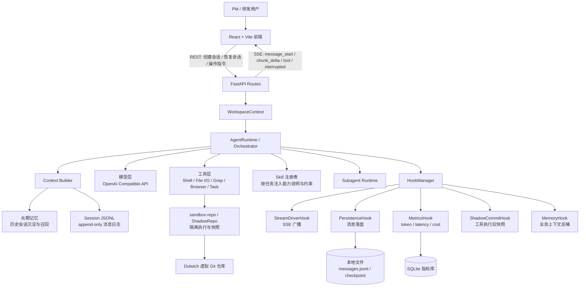

# 技术说明

## 1. 核心技术栈

### 前端

- React 19：构建会话界面、消息卡片、工具调用展示和提交过程展示。
- Vite：提供本地开发、构建和热更新能力。
- TypeScript：约束前端状态、消息协议和 API 类型。
- SSE：接收后端流式事件，展示模型增量输出、工具调用进度和中断状态。
- marked / highlight.js / KaTeX / Mermaid：支持 Markdown、代码高亮、公式和架构图渲染。
- Vitest + Testing Library + ESLint：支撑前端单测、组件测试和静态检查。

### 后端

- Python 3.14：后端运行环境。
- FastAPI + Uvicorn：提供 REST API、OpenAPI 协议和 SSE 服务。
- Pydantic：定义请求、响应、消息和配置模型。
- OpenAI Compatible API：连接模型层，支持替换不同厂商或私有化模型服务。
- LangChain Core：复用部分模型消息和工具抽象能力。
- Dulwich：实现无需系统 Git 进程的影子仓库和提交快照。
- Playwright：提供浏览器自动化能力，用于页面检查和端到端交互扩展。
- Ruff + Pytest：支撑后端代码质量和测试。

### 数据与持久化

- Session JSONL：保存会话消息、工具结果和系统上下文，采用 append-only 方式便于重放和审计。
- 本地文件 checkpoint：保存可恢复的执行状态。
- SQLite：保存 LLM 调用指标，如 token、延迟和成本，供监控面板分析。
- 无业务数据库依赖：核心会话和工程状态优先使用文件系统表达，降低本地部署和比赛演示复杂度。

### 中间件与通信

- REST：处理会话创建、恢复、状态查询等确定性请求。
- SSE：处理 Agent 流式输出，降低前端实时展示复杂度。
- HookManager：作为后端内部事件中间层，解耦主循环和副作用。
- OpenAPI：作为前后端协议边界，并通过类型生成保证跨栈一致性。

### 部署环境与云资源

- 本地开发：后端通过 `uv` 管理依赖并运行 `uvicorn`，前端通过 `npm` 和 Vite 启动。
- 一键启动：仓库提供 `start.sh`、`start-cli.sh` 和 `lint.sh`，支持 Web 演示、CLI 演示和质量检查。
- 云资源：系统本身不强绑定云厂商，只依赖可配置的 LLM API Key、Base URL 和 Model ID；可接入公有云模型、私有化模型网关或企业内部模型服务。
- CI / 提交扩展：Agent 可通过 GitHub CLI 或 MCP 扩展到 PR 创建、CI 检查和自动修复链路。

## 2. 系统架构图

本项目面向“PM 自然语言输入需求，Agent 自动完成代码修改、校验并提交 PR”的端到端研发场景。整体采用前后端分离架构：前端负责会话、流式消息、工具调用过程和提交结果展示；后端负责 Agent 编排、模型调用、工具执行、上下文构建、会话持久化、指标采集和沙箱仓库管理。

核心链路如下：

1. 用户在前端输入需求，前端通过 REST 创建或恢复会话，并通过 SSE 接收 Agent 的流式推理、工具调用和中断状态。
2. 后端 `FastAPI routes` 将请求交给业务服务层，服务层构造 `WorkspaceContext`，统一管理会话、工作区、配置、Hook 和沙箱仓库。
3. `AgentRuntime / Orchestrator` 执行 ReAct 主循环：构建上下文、调用模型、解析工具调用、执行工具、写入消息，再进入下一轮决策。
4. `Skill 注册表` 将可复用的任务经验、约束和操作流程作为上下文能力注入，降低不同需求模式的接入成本。
5. `HookManager` 将主循环中的关键事件广播给旁路系统，包括前端流式展示、JSONL 持久化、指标采集、影子仓库快照和长期记忆沉淀。
6. `sandbox-repo / ShadowRepo` 为代码修改和工具执行提供隔离层，每次关键动作后生成快照，支撑断点恢复、回滚分析和提交前审计。

## 3. 关键工程难点与解决方案

### 3.1 上下文召回精度：从“暴力塞文件”到“按意图构建上下文”

Agent 写真实业务代码时，最容易失败的点不是模型不会写代码，而是上下文给错：文件太少会漏改，文件太多会稀释注意力并浪费 token。早期方案如果把检索结果和历史消息简单拼接，容易出现“前端改了字段，后端接口没同步”“只看到调用方，没看到类型定义”等问题。

本项目将上下文拆为几类来源：当前会话消息、系统约束、Skill、长期记忆、仓库检索结果和工具执行反馈。检索侧优先使用精确搜索能力定位符号、接口、路由和测试，再由 Agent 根据任务意图选择要读取的文件，而不是一次性塞入大量无关切片。长期记忆则沉淀历史需求中的业务规则，新会话可自动召回，减少重复解释。

该方案带来的收益是：上下文更短、更贴近任务，模型能更稳定地围绕真实代码结构推理；同时，append-only 的消息组织方式让系统 prompt、Skill、任务和记忆都以消息形式进入会话，便于复盘每次决策依据。

### 3.2 跨栈类型一致性：用协议和生成类型约束前后端边界

端到端改需求通常跨越前端组件、后端路由、服务层、数据模型和测试。如果只让 Agent 从 UI 入口出发修改，很容易出现前端字段名、后端响应模型和测试断言不一致的问题。

本项目在后端使用 Pydantic 定义请求和响应模型，并通过 FastAPI 暴露 OpenAPI 协议；前端使用 `openapi-typescript` 生成 `types.generated.ts`，让接口字段以类型形式进入 TypeScript 编译链路。Agent 修改接口时，需要同时关注后端 schema、路由、前端调用和测试，避免只改一侧。

这套机制的价值在于把“跨栈一致性”从人工记忆变成工程约束：协议变更能被类型生成、前端构建和测试捕获，Agent 的改动也更容易被 Lint、单测和构建流水线验证。

### 3.3 Hook 机制：把 Agent 主循环和工程副作用解耦

Agent 主循环天然会产生大量副作用：流式输出要推给前端，消息要落盘，工具执行要记录，指标要统计，代码修改后要快照，长期记忆要沉淀。如果这些逻辑直接写进主循环，系统会很快变成难以维护的流程脚本。

项目采用 Hook 机制将副作用拆成独立模块。主循环只负责发出标准事件，例如模型开始、消息增量、工具调用、工具完成、轮次完成和中断；不同 Hook 订阅这些事件并完成自己的职责。`StreamDriverHook` 负责 SSE，`PersistenceHook` 负责 JSONL，`MetricsHook` 负责 token 和延迟指标，`ShadowCommitHook` 负责影子仓库快照，`MemoryHook` 负责历史经验沉淀。

这种设计让新增能力的接入成本更低：例如增加监控面板、审计日志、企业规范检查时，可以新增 Hook，而不需要改动 Agent 决策主干。Hook 异常也可以被隔离处理，避免旁路能力影响主任务执行。

### 3.4 Skill 注册与热加载：把“经验”从代码中剥离出来

比赛场景下，需求模式会不断变化：新增页面、修改接口、补测试、生成 PR、处理 CI 失败，背后都有不同的操作流程和约束。如果每种能力都写死在 Orchestrator 里，系统很难扩展，也不利于团队沉淀经验。

项目将 Skill 设计为可注册的能力单元，用于描述特定任务的流程、边界、注意事项和可调用工具。Agent 在构建上下文时按任务选择相关 Skill 注入，从而让“如何做某类任务”的知识不再散落在代码分支里。前端也可以围绕 Skill 做配置和展示，使新规范、新页面类型、新需求模式能通过注册接入，而不是修改主流程。

实践中的一个重要洞察是：Skill 和 Tool 的边界必须清晰。Tool 负责执行确定性动作，例如读文件、搜索、运行命令；Skill 负责提供任务方法论和上下文约束。二者配合后，Agent 不只是“会调用工具”，而是知道在什么场景下应该以什么顺序、带着什么约束调用工具。

### 3.5 断点重放与影子仓库：让 Agent 过程可暂停、可审计、可恢复

真实研发中，Agent 不能是一次性黑盒执行。用户需要在发现方向错误、网络超时、工具失败或模型误判时中断流程，并从某个稳定状态继续。

项目用 append-only 会话日志保存每一步消息，结合 checkpoint 和 `ShadowRepo` 保存代码状态。每次关键工具执行后，系统通过 Dulwich 维护影子 Git 快照，使“消息过程”和“文件状态”能够对应起来。当前端收到 interrupted 状态后，用户可以查看中断原因、补充指令或恢复会话。

这一机制让 Agent 从“生成一次答案”升级为“可协作的工程流程”：人类可以介入、修正、继续，系统也能追溯每次修改来自哪轮模型决策和哪次工具调用。

### 3.6 安全防护机制：控制 Agent 的工具边界

Agent 能操作 Shell、文件和浏览器后，安全边界就成为基础工程问题。项目通过工作区上下文、工具执行 guard、沙箱仓库和受控 Hook 将 Agent 的影响范围限制在目标工作区内；对文件读写、命令执行、浏览器动作等能力进行工具化封装，而不是让模型直接获得无限制系统权限。

此外，系统强调“先观察、再修改、再验证”的执行节奏：修改前先定位文件和上下文，修改后通过 Lint、测试、构建或快照检查结果。这样既提升了代码生成可靠性，也为后续接入企业权限、审计和合规机制留下接口。

## 4. 项目亮点与创新点

1. **以 Message 为中心的统一协议**：模型上下文、前端展示、SSE 事件和持久化日志都围绕同一套消息模型组织，减少状态转换带来的不一致。
2. **Hook 化 Agent 工程架构**：将流式输出、持久化、指标、快照和记忆沉淀从主循环拆出，使核心决策逻辑保持简洁，也方便后续扩展。
3. **append-only 会话与断点重放**：每一步操作都可追溯，用户可在中途打断、补充指令并继续，适合真实协作式研发流程。
4. **影子 Git 仓库机制**：通过沙箱快照记录代码状态，让文件修改、工具调用和模型决策之间建立可审计关系。
5. **Skill 注册化能力扩展**：将任务经验、流程约束和工程规范抽象成可注册 Skill，新需求模式可通过配置和上下文注入扩展。
6. **跨栈类型一致性保障**：FastAPI + Pydantic + OpenAPI + TypeScript 类型生成形成协议闭环，减少前后端字段漂移。
7. **上下文工程优先于盲目多 Agent**：项目实践中发现，过度使用 subagent 会增加延迟和上下文噪声；更有效的方式是提升上下文召回质量、工具边界和 Skill 质量。
8. **低依赖、易演示的本地优先架构**：核心状态基于文件和 SQLite 保存，不依赖复杂数据库或云基础设施，便于比赛现场稳定演示和复现。

## 5. 工程实践总结

本项目的核心技术判断是：端到端研发 Agent 的难点不只是“让模型会写代码”，而是把模型能力放进可控、可观察、可恢复的工程系统中。Hook 机制解决可扩展性，Skill 机制解决经验复用，影子仓库和 append-only 日志解决可追溯与断点恢复，上下文召回和跨栈类型约束解决真实仓库落地的正确性。

因此，系统最终形成了一套轻量但完整的 Agent 工程化框架：前端可实时观察，后端可编排，工具可控，状态可恢复，指标可度量，经验可沉淀。它既能覆盖比赛要求的 P1 级需求现场实现，也为后续接入企业规范、CI 自动修复和多项目复用提供了扩展空间。
