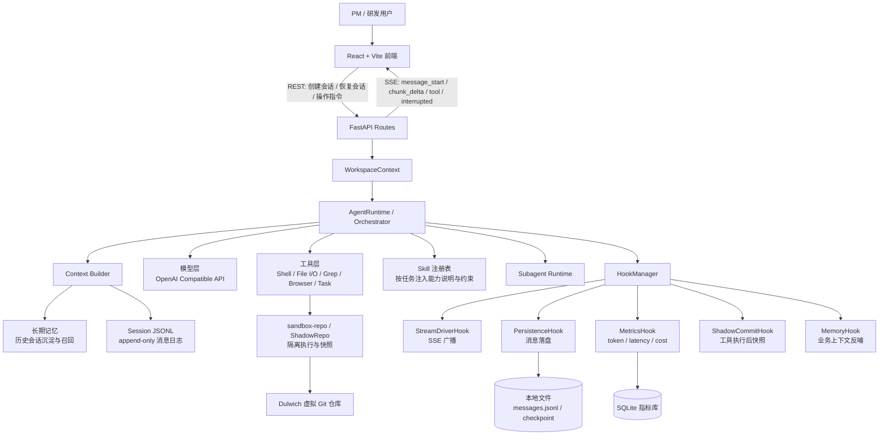

# 技术说明

## 1. 核心技术栈

### 前端

- React 19：构建会话界面、消息卡片、工具调用展示和提交过程展示。
- Vite：提供本地开发、构建和热更新能力。
- TypeScript：约束前端状态、消息协议和 API 类型。
- marked / highlight.js / KaTeX / Mermaid：支持 Markdown、代码高亮、公式和架构图渲染。
- Vitest + Testing Library + ESLint：支撑前端单测、组件测试和静态检查。

### 后端

- Python 3.14：后端运行环境。
- FastAPI + Uvicorn：提供 REST API、OpenAPI 协议和 SSE 服务。
- Pydantic：定义请求、响应、消息和配置模型。
- OpenAI Compatible API：连接模型层，支持替换不同厂商或私有化模型服务。
- LangChain Core：复用部分模型消息和工具抽象能力。
- Dulwich：实现无需系统 Git 进程的影子仓库和提交快照。
- Playwright：提供浏览器自动化能力，用于页面检查和端到端交互扩展。
- Ruff + Pytest：支撑后端代码质量和测试。

### 数据与持久化

- Session JSONL：保存会话消息、工具结果和系统上下文，采用 append-only 方式便于重放和审计。
- 本地文件 checkpoint：保存可恢复的执行状态。
- SQLite：保存 LLM 调用指标，如 token、延迟和成本，供监控面板分析。

## 2. 系统架构图

本项目面向“PM 自然语言输入需求，Agent 自动完成代码修改、校验并提交 PR”的端到端研发场景。整体采用前后端分离架构：前端负责会话、流式消息、工具调用过程和提交结果展示；后端负责 Agent 编排、模型调用、工具执行、上下文构建、会话持久化、指标采集和沙箱仓库管理。

核心链路如下：

1. 用户在前端输入需求，前端通过 REST 创建或恢复会话，并通过 SSE 接收 Agent 的流式推理、工具调用和中断状态。
2. 后端 `FastAPI routes` 将请求交给业务服务层，服务层构造 `WorkspaceContext`，统一管理会话、工作区、配置、Hook 和沙箱仓库。
3. `AgentRuntime / Orchestrator` 执行 ReAct 主循环：构建上下文、调用模型、解析工具调用、执行工具、写入消息，再进入下一轮决策。
4. `Skill 注册表` 将可复用的任务经验、约束和操作流程作为上下文能力注入，降低不同需求模式的接入成本。
5. `HookManager` 将主循环中的关键事件广播给旁路系统，包括前端流式展示、JSONL 持久化、指标采集、影子仓库快照和长期记忆沉淀。
6. `sandbox-repo / ShadowRepo` 为代码修改和工具执行提供隔离层，每次关键动作后生成快照，支撑断点恢复、回滚分析和提交前审计。

## 3. 关键工程难点与解决方案

### 3.1 上下文召回精度：从“暴力塞文件”到“按意图构建上下文”

- **背景/问题**：
  - **编辑定位不准**：在早期联调中，我们发现 Agent 的主要问题不是完全写不出代码，而是上下文定位不够精确。修改文件时，如果只把搜索命中的几行交给模型，它往往缺少完整函数或类上下文，后续 `write/edit` 容易因为代码块匹配不准、插入位置错位而失败。
  - **接口细节缺失**：处理接口相关需求时，如果只看到调用方，没有同步读到后端路由、schema 和返回结构，模型就难以确认字段名、参数约束和错误处理细节，容易产生局部看似合理、整体协议不完整的问题。
  - **上下文噪声过多**：反过来，如果把相关目录整段塞进上下文，又会让关键接口信息被大量无关代码淹没，模型需要在噪声中自行筛选重点，输出稳定性和修改效率都会下降。
- **调研与解决方案**：
  - **RAG 方案验证**：我们先尝试过接近 RAG 的思路，把仓库文件切片后按相似度召回，再把命中的片段拼进 prompt。但在代码修改场景里，单纯语义相似并不等于可编辑上下文，召回结果经常只有局部片段，缺少函数边界、类型定义、调用链和测试入口；如果为了保险提高召回数量，又会把很多相似但无关的代码一起塞进来，反而增加模型判断成本。
  - **编码 Agent 调研**：调研 Cursor、Claude Code 等市面上的编码 Agent 后，我们发现它们更倾向于“工具驱动的渐进式上下文构建”：先用搜索、文件列表、符号定位等工具缩小范围，再按任务意图读取完整文件或关键代码块，而不是一次性把检索结果交给模型。
  - **项目落地方式**：基于这个判断，我们把上下文拆成当前会话消息、系统约束、Skill、长期记忆、仓库检索结果和工具执行反馈几类来源；检索侧优先使用 `Grep` 和 `Glob` 精确定位符号、接口、路由、类型定义和测试文件，再由 Agent 决定继续读取哪些文件、是否补充调用方或定义方。对于 Skill、长期记忆和任务状态，则通过 append-only 的 `Context Update` 追加为 system message，让补充上下文成为可追溯的会话记录，而不是覆盖用户需求或依赖临时变量。
- **效果提升**：
  - **修改正确率提升**：上下文更短、更贴近当前任务后，模型可以围绕真实代码结构推理，减少跨文件漏改和无关信息干扰。对于修改类任务，精确检索和完整代码块读取显著提升了 `write/edit` 的匹配正确率，减少了反复重试、手动修补和错位写入的情况。
  - **执行效率提升**：Agent 不再需要在大量无关文件中反复确认上下文，单轮决策更快，工具调用链路也更短，整体完成任务的速度更高。
  - **会话可追溯性提升**：对于连续会话，长期记忆和任务状态可自动召回历史业务规则，降低重复解释成本；每次上下文注入都会进入消息日志，便于复盘模型当时依据了哪些 Skill、记忆和任务状态。

### 3.2 Hook 机制：把 Agent 主循环和工程副作用解耦

- **背景/问题**：
  - **副作用集中**：Agent 主循环天然会产生大量工程副作用，包括流式输出推送、消息落盘、工具执行记录、token 和延迟统计、代码快照、长期记忆沉淀等。
  - **主流程膨胀**：如果这些逻辑都直接写进 ReAct 循环，主流程会从“决策编排”退化成难以维护的流程脚本，模型调用、工具执行和工程记录彼此耦合。
  - **扩展风险高**：后续新增监控、审计、权限审批或记忆能力时，都可能牵动核心执行链路，增加回归风险，也不利于定位是主任务失败还是旁路能力失败。
- **调研与解决方案**：
  - **工程模式调研**：我们参考 callback / middleware 的设计思路，将主循环中的关键节点抽象为事件，让核心逻辑只负责发出通知，不直接承载所有工程副作用。
  - **Hook 基础设施**：项目实现了 `BaseHook` 和 `HookManager`，统一管理 message start、chunk delta、message finish、turn start、turn end、guard check、context assemble 等标准事件，并对单个 Hook 的异常做隔离。
  - **能力模块拆分**：具体副作用由独立 Hook 订阅：`StreamDriverHook` 负责 SSE，`PersistenceHook` 负责 JSONL 持久化，`MetricsHook` 负责指标，`ShadowCommitHook` 负责影子仓库快照，`ToolPermissionHook` 负责工具审批，`MemoryHook` 负责长期记忆召回与沉淀。
- **效果提升**：
  - **主循环更清晰**：Hook 化后，核心 `AgentRuntime` 可以聚焦在会话管理、打断恢复和轮次执行这些主职责上，决策链路更容易阅读和维护。
  - **扩展成本更低**：新增监控面板、审计日志、企业规范检查等能力时，只需要增加 Hook，不需要改动 Agent 决策主干。
  - **稳定性更好**：旁路能力失败不会直接拖垮主任务，系统在比赛演示和长任务执行时更容易保持稳定，也方便通过日志定位具体 Hook 的问题。

### 3.3 runtime/context 架构

- **背景/问题**：
  - **状态归属不清**：项目早期的执行模型更接近一个简单 agent loop，路由层、会话状态、模型调用、工具执行和上下文拼装混在一起，很多状态只能靠临时变量在流程中传递。
  - **恢复能力不足**：随着需求增加到多会话、SSE 恢复、工具权限、中断续跑等场景，简单循环很难回答“当前运行的是哪个 session、停在哪个 turn、是否还有 pending 请求、恢复时应该从哪里读状态”。
  - **上下文难以审计**：如果每轮上下文都在运行时临时拼装，出问题后很难复盘模型当时看到了哪些系统约束、用户消息、工具结果和动态补充信息。
- **调研与解决方案**：
  - **运行时分层**：我们将系统拆成 `WorkspaceContext`、`AgentRuntime`、`RuntimeSession` 和 message context 几层。`WorkspaceContext` 负责工作区级资源和路径归一，`AgentRuntime` 负责 session 创建、运行状态、打断恢复和 ReAct 轮次编排，`RuntimeSession` 则承载单个会话的配置和 transcript。
  - **状态按层收敛**：工作区、运行时、会话、轮次和消息分别有明确归属，API 服务层只负责找到对应 workspace 和 session，不直接拼装 Agent 内部状态；运行时内部则围绕 `session_id` 管理 active run、pending request、interrupt event 和 streaming message。
  - **上下文消息化**：上下文构建统一从会话 JSONL 中读取 LLM 投影，用户输入、assistant 输出、工具结果和动态 `Context Update` 都以 append-only message 形式保存，避免每轮依赖不可追溯的临时上下文变量。
- **效果提升**：
  - **恢复链路更稳定**：中断、刷新或继续会话时，可以围绕 session 文件和 runtime 状态恢复当前进度，减少前后端状态不一致。
  - **排障路径更清楚**：问题可以沿着 workspace、runtime、session、turn、message 逐层定位，而不是在一整段 agent loop 中猜测状态来源。
  - **上下文可回放**：模型每轮依据的用户消息、工具反馈和系统补充都保存在消息流中，便于复盘、审计和后续优化上下文策略。

## 4. 项目亮点与创新点

1. **扩展性强：Skill / Hook / 约束注册化**
   - Skill 以目录形式注册在 `backend/agent/skills/<name>/SKILL.md`，`backend/agent/tools/skill.py` 会同时扫描内置 Skill 和 `.byte_agent/skills` 下的自定义 Skill，并支持同名自定义 Skill 覆盖内置版本。
   - 每轮模型调用前都会注入可用 Skill 摘要，模型需要时通过 `LoadSkill` 读取完整内容；前端会话配置也支持 `preloaded_skills`、`rules`、`tool_set_preset` 和 `custom_tools`，使不同项目或需求类型可以通过配置改变 Agent 行为，而不是修改主循环代码。
   - 工程副作用通过 `shared/hooks.py` 中的 `BaseHook` / `HookManager` 注册，`WorkspaceContext` 统一挂载 `StreamDriverHook`、`MetricsHook`、`PersistenceHook`、`ShadowCommitHook`、`ToolPermissionHook`、`MemoryHook` 等能力。新增监控、审计、记忆或权限策略时，只需要新增 Hook 或配置项，核心 `AgentRuntime` 保持稳定。

2. **断点重放：可暂停、可修改、可 rewind**
   - 会话消息通过 `SessionTranscript` 以 append-only JSONL 保存，`/api/session/{sid}/recover` 可以从磁盘消息、当前流式消息和 pending request 重建前端状态；`/api/session/{sid}/stream` 会先重放历史消息，再接入实时 SSE。
   - 运行时中断由 `AgentRuntime.interrupt()` 设置 session 级 `interrupt_event`，Shell、PyRepl、WebSearch、WebFetch 等长耗时工具会响应中断；前端 `AgentInput` 暴露 interrupt 操作，用户可在 Agent 生成中途暂停并补充指令。
   - rewind 分成“消息历史”和“工作区状态”两条线：`truncate_by_id()` 和 `/api/session/{sid}/messages/truncate` 可按 message id 截断会话；`ShadowCommitHook` 在关键节点写入影子 Git 快照，`/api/session/{sid}/workspace/restore` 可恢复到指定 commit。前端 `EditableUserBubble` 和 `CommitGraphPanel` 将这两条能力组合成编辑用户消息、删除后续历史、恢复工作区并重新发送的交互。

3. **跨栈一致性：后端 schema、OpenAPI、前端类型闭环**
   - 后端 API 请求、响应和 SSE 事件以 Pydantic schema 定义，核心消息协议集中在 `backend/shared/types.py`，REST 响应集中在 `backend/app/schemas`，避免接口字段散落在路由实现里。
   - 前端 `src/types.ts` 从 `src/types.generated.ts` 导入 OpenAPI 生成类型，`frontend/package.json` 提供 `gen-types` / `gen-types:local`，通过 `openapi-typescript` 从 FastAPI `/openapi.json` 生成 TypeScript 类型。
   - Metrics、Session、Memory、Settings 等前端调用使用生成类型或共享类型别名；当后端字段变化时，类型生成和 TypeScript 编译会暴露前后端字段漂移，减少“只改前端或只改后端”的不一致。

4. **可观测性：LLM 调用指标与监控面板**
   - `MetricsHook` 在每次 assistant message 开始和结束时统计延迟，并把模型、session、message、finish reason、prompt / completion / reasoning / cache token、错误和费用写入 `SQLiteLLMMetricsStore`。
   - `backend/app/api/routes/metrics.py` 提供 `/api/metrics/llm/calls`、`/summary`、`/dashboard`、`/series` 和 `/pricing`，既能查看单次调用明细，也能按时间、模型和工作区聚合成本与 token。
   - 前端 `MetricsPanel` 展示成本趋势、token 结构柱状图、模型筛选和价格配置；消息卡片里的 `TokenBubble` 会按 message id 查询调用明细，用户可以在对话流中直接看到单条回复的 token 与费用。

5. **业务上下文反哺：历史消息沉淀为长期记忆**
   - `MemoryHook` 在 turn 结束后从用户和 assistant 消息中抽取 durable memory，只保留偏好、项目事实、技术决策、TODO 和摘要，并用敏感信息正则过滤 token、密码、密钥等内容。
   - 记忆持久化在 `SQLiteMemoryStore`，表结构包含 workspace、session、scope、kind、feature、confidence、use_count 等字段，并用 SQLite FTS5 支持混合中英文检索。
   - 下一轮上下文构建时，`MemoryHook.on_context_assemble()` 会先按 workspace / session 取候选记忆，再用轻量 LLM rerank 选择和当前需求相关的记忆，以 `Long-term Memory` system message 注入模型。这样历史业务规则和团队偏好可以自动反哺新会话，而不是每次重新说明。

6. **澄清深度：识别歧义并主动追问**
   - 工具层实现了 `AskUser`，支持选项、自由文本问题、必填校验、多选和自定义输入，模型在需求存在接口口径、字段含义、交互边界或验收标准不明确时，可以发起结构化追问，而不是自行假设。
   - Runtime 将 `AskUser` 转成 `user_input_request` pending request，进入 `SessionStatus.PENDING`，并通过 `NotificationDriverHook` / SSE 推送到前端；用户回答后由 `/api/session/{sid}/respond` 唤醒原来的 tool call，继续同一个 Agent turn。
   - 前端 `PendingRequestPanel` 会把追问渲染成可选择、可填写、可忽略的输入卡片，与权限审批共用 pending 机制。这样 PM 的模糊需求可以在生成代码前被拆解确认，减少错误实现和返工。

7. **安全防护机制**
   - `ToolPermissionHook` 对写文件、执行命令等高风险操作做审批；`GuardDecision` 支持 allow / ask / deny，前端以 pending 面板要求用户确认。
   - `MemoryHook` 在沉淀长期记忆前过滤密钥、token、密码和私钥片段，避免把敏感信息写入可召回上下文。
   - 工具执行、消息持久化和影子仓库快照分层记录，既方便审计，也让中断、恢复和回滚有明确边界。

## 5. 工程实践总结

本项目的核心技术判断是：端到端研发 Agent 的难点不只是“让模型会写代码”，而是把模型能力放进可控、可观察、可恢复的工程系统中。Hook 机制解决可扩展性，Skill 机制解决经验复用，影子仓库和 append-only 日志解决可追溯与断点恢复，上下文召回和跨栈类型约束解决真实仓库落地的正确性。

因此，系统最终形成了一套轻量但完整的 Agent 工程化框架：前端可实时观察，后端可编排，工具可控，状态可恢复，指标可度量，经验可沉淀。它既能覆盖比赛要求的 P1 级需求现场实现，也为后续接入企业规范、CI 自动修复和多项目复用提供了扩展空间。