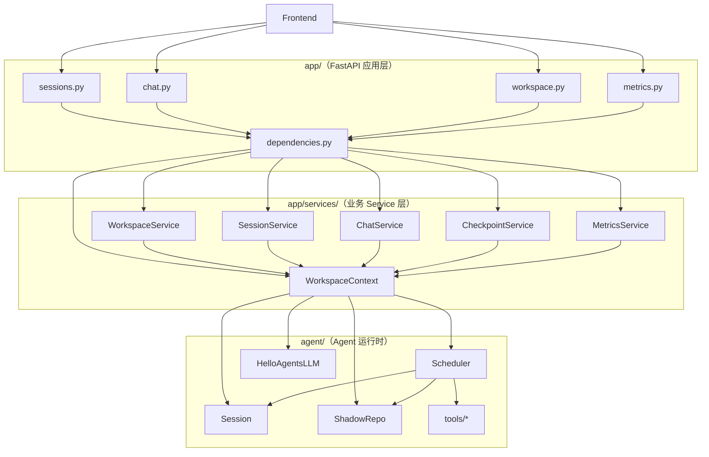

# 后端 Service 架构与整体流程

> 本文描述当前 backend 在 Phase 2 解耦完成后的分层结构、核心组件职责，以及典型请求的调用链路。

## 1. 设计目标

后端采用 **Router → Service → WorkspaceContext → Agent** 四层结构：

- **Router**：只做 HTTP 协议适配（入参校验、出参、异常映射、SSE 包装）
- **Service**：按业务用例编排逻辑，不暴露 agent 内部对象给 Router
- **WorkspaceContext**：进程内唯一有状态容器，持有 scheduler / sessions / shadow_repo 等共享资源
- **Agent**：ReAct 循环、LLM 调用、工具执行、transcript 持久化等运行时能力

各层边界：

| 层级 | 可以做 | 不可以做 |
|---|---|---|
| Router | 声明路由、Depends 注入 Service、HTTPException | import `agent.*`、访问 `_transcripts` 等私有字段 |
| Service | 编排业务、调用 Context 与 Agent 公开 API | 理解 HTTP 概念 |
| WorkspaceContext | 管理共享运行时状态 | 包含具体业务用例逻辑 |
| Agent | 提供 session / scheduler / tools 等能力 | import `app.*`（Phase 3 目标：彻底移除） |

---

## 2. 目录结构

```text
backend/
├── main.py                          # FastAPI 入口，create_app()
├── app/
│   ├── dependencies.py              # DI：get_context() + 各 Service provider
│   ├── core/
│   │   ├── config.py                # 应用配置（workspace 路径、TMP_DIR 等）
│   │   └── cors.py
│   ├── schemas/                     # Pydantic 请求/响应模型
│   │   ├── chat.py
│   │   └── workspace.py
│   ├── api/
│   │   ├── router.py                # 汇总所有 route module
│   │   ├── sse.py                   # SSE 行格式与 flush 辅助
│   │   └── routes/
│   │       ├── health.py            # 健康检查（不经过 Service）
│   │       ├── workspace.py         # → WorkspaceService
│   │       ├── sessions.py          # → SessionService + CheckpointService
│   │       ├── chat.py              # → ChatService
│   │       └── metrics.py           # → MetricsService
│   └── services/
│       ├── context.py               # WorkspaceContext（共享状态）
│       ├── workspace_service.py
│       ├── session_service.py
│       ├── chat_service.py
│       ├── checkpoint_service.py
│       └── metrics_service.py
└── agent/                           # Agent 运行时（与 FastAPI 解耦的目标层）
    ├── scheduler.py                 # 单例调度器，ReAct 主循环
    ├── session.py                   # Session 数据容器 + JSONL 持久化
    ├── transcript.py                # 流式 transcript 通道
    ├── shadow_repo.py               # workspace 快照 / checkout
    ├── actions.py                   # model_call、tool 执行
    ├── llm.py                       # LLM 客户端
    ├── sandbox.py                   # 工具运行环境
    ├── metrics.py                   # SQLite LLM 指标存储
    └── tools/                       # Read / Write / Shell / Browser 等
```

---

## 3. 架构总览



---

## 4. 核心：WorkspaceContext

文件：`app/services/context.py`

**WorkspaceContext 是后端唯一的有状态对象**。进程内通过 `@lru_cache` 的 `get_context()` 保证单例；所有 Service 构造时接收同一个 Context 引用。

### 4.1 持有的共享资源

| 资源 | 类型 | 说明 |
|---|---|---|
| `workspace` | `str` | 当前 agent 工作目录（绝对路径） |
| `_sessions` | `dict[str, Session]` | 内存 session 缓存，懒加载 |
| `scheduler` | `Scheduler` | 全局唯一，同一 workspace 同时只跑一个 agent |
| `shadow_repo` | `ShadowRepo` | workspace 文件快照，支持 commit / checkout |
| `llm` | `HelloAgentsLLM` | LLM 客户端，懒初始化 |
| `metrics_store` | `SQLiteLLMMetricsStore` | LLM 调用指标持久化 |

### 4.2 提供的内部方法

| 方法 | 用途 |
|---|---|
| `get_session(sid)` | 从缓存或磁盘 JSONL 加载 Session |
| `get_info(sid)` | 返回 session 元信息（不触发加载） |
| `put_session / pop_session` | 创建 / 删除 session 缓存 |
| `set_workspace(path)` | 切换 workspace，重置 shadow_repo 和 metrics 路径 |

### 4.3 为什么 Service 不能各自独立

如果每个 Service 自己 `new Scheduler()` 或 `new dict()`，会导致：

- Session A 在跑 chat，Session B 的 `/status` 却显示 idle
- checkout 截断了 transcript，chat 仍持有旧 Session 对象
- 两个 shadow_repo 实例写同一路径，行为未定义

**Service 是无状态门面，Context 是有状态核心。**

---

## 5. Service 层职责

所有 Service 的构造签名统一为 `__init__(self, ctx: WorkspaceContext)`，只持有 Context 引用，不持有自有可变状态。

### 5.1 WorkspaceService

| 方法 | 说明 |
|---|---|
| `get_workspace()` | 返回当前 workspace 路径 |
| `set_workspace(path)` | 切换 workspace（校验目录存在） |
| `resolve_workspace(path)` | 解析相对/绝对路径 |

**路由**：`GET/POST /api/workspace`

### 5.2 SessionService

| 方法 | 说明 |
|---|---|
| `create_session()` | 创建 session 目录和空 messages.jsonl |
| `list_sessions()` | 扫描 `.tmp/` 下列出所有 session |
| `get_info / get_history` | session 元信息与对话历史 |
| `delete_session(sid)` | 清理内存、shadow branch、磁盘目录 |
| `get_session_status(sid)` | 当前 sid 是否在 scheduler 中运行 |
| `get_recovery_state(sid)` | 前端刷新恢复：transcripts + running |
| `interrupt_session(sid)` | 中断指定 session 的运行 |
| `interrupt_current()` | 中断当前全局运行任务 |

**路由**：`/api/session*`（除 commits / checkout 外）

### 5.3 ChatService

| 方法 | 说明 |
|---|---|
| `start_chat(sid, question, max_steps)` | 创建 TranscriptStream → 启动 scheduler → 返回 `ActiveStream` |
| `get_stream(sid)` | SSE 重连用：返回 Session + 当前 channel |
| `respond_to_pending(tid, response)` | 响应人机交互 pending 请求 |

**路由**：`/api/session/{sid}/chat`、`/stream`、`/respond`

### 5.4 CheckpointService

| 方法 | 说明 |
|---|---|
| `list_commits(sid)` | 列出 shadow repo commits |
| `get_commit(sid, sha)` | 单个 commit 元数据 |
| `checkout_session(sid, req)` | 恢复 workspace + 截断 transcript + 重建 tasks |

**路由**：`/api/session/{sid}/commits*`、`/checkout`

### 5.5 MetricsService

| 方法 | 说明 |
|---|---|
| `list_llm_calls(...)` | 分页查询 LLM 调用记录 |
| `get_llm_summary(...)` | 汇总统计 |
| `get_llm_dashboard(...)` | 仪表盘数据 |

**路由**：`/api/metrics/llm/*`

---

## 6. 依赖注入流程

文件：`app/dependencies.py`

```python
@lru_cache
def get_context() -> WorkspaceContext:
    settings = get_settings()
    return WorkspaceContext(settings.agent_workspace, metrics_db_path=...)

def get_session_service() -> SessionService:
    return SessionService(get_context())   # 每次新建 Service，共享同一 Context
```

FastAPI 路由通过 `Depends(get_xxx_service)` 注入：

```python
@router.post("/session")
def create_session(
    session_service: SessionService = Depends(get_session_service),
) -> dict:
    return session_service.create_session()
```

**要点**：

- `get_context()` 有 `@lru_cache` → 进程生命周期内只有一个 Context
- 各 `get_xxx_service()` 无 cache → 每次请求新建 Service 实例，但 `_ctx` 相同
- Router 不直接依赖 Context，只依赖具体 Service

---

## 7. API 端点映射

| HTTP | 路径 | Service | 主要方法 |
|---|---|---|---|
| GET | `/` | — | 健康检查 |
| GET | `/api/workspace` | WorkspaceService | `get_workspace` |
| POST | `/api/workspace/set` | WorkspaceService | `set_workspace` |
| POST | `/api/session` | SessionService | `create_session` |
| GET | `/api/sessions` | Workspace + Session | `get_workspace` + `list_sessions` |
| DELETE | `/api/session/{sid}` | SessionService | `delete_session` |
| GET | `/api/session/{sid}/history` | SessionService | `get_info` + `get_history` |
| GET | `/api/session/{sid}/status` | SessionService | `get_session_status` |
| GET | `/api/session/{sid}/recover` | SessionService | `get_recovery_state` |
| GET | `/api/session/{sid}/commits` | CheckpointService | `list_commits` |
| GET | `/api/session/{sid}/commits/{sha}` | CheckpointService | `get_commit` |
| POST | `/api/session/{sid}/checkout` | CheckpointService | `checkout_session` |
| POST | `/api/session/{sid}/interrupt` | SessionService | `interrupt_session` |
| POST | `/api/interrupt` | SessionService | `interrupt_current` |
| POST | `/api/session/{sid}/chat` | ChatService | `start_chat` → SSE |
| GET | `/api/session/{sid}/stream` | ChatService | `get_stream` → SSE |
| POST | `/api/session/{sid}/respond` | ChatService | `respond_to_pending` |
| GET | `/api/metrics/llm/calls` | MetricsService | `list_llm_calls` |
| GET | `/api/metrics/llm/summary` | MetricsService | `get_llm_summary` |
| GET | `/api/metrics/llm/dashboard` | MetricsService | `get_llm_dashboard` |

---

## 8. 典型请求流程

### 8.1 创建 Session

```text
POST /api/session
  → sessions.py: create_session()
  → SessionService.create_session()
    → ctx._messages_path(sid).touch()          # 创建空 JSONL
    → ctx.put_session(sid, ctx._build_session) # 内存加载 Session
  ← {"session_id": "...", "workspace": "..."}
```

### 8.2 发起 Chat（SSE 流式响应）

```text
POST /api/session/{sid}/chat  {"question": "...", "max_steps": 50}
  → chat.py: chat()
  → ChatService.start_chat(sid, question, max_steps)
    → ctx.get_session(sid)                     # 获取/加载 Session
    → TranscriptStream() + subscribe()         # 先订阅，再启动（防丢事件）
    → ctx.scheduler.start(session, question, channel, shadow_repo)
      → agent/actions.py: ReAct 循环
        → model_call → execute_one_tool → ...
        → channel.flush() → SSE 事件
    ← ActiveStream(channel, queue)
  → router 包装 queue 为 SSE Response
```

**并发限制**：scheduler 非 idle 时 `start()` 抛 `RuntimeError` → router 返回 **409 Conflict**。

### 8.3 SSE 重连（页面刷新）

```text
GET /api/session/{sid}/stream
  → ChatService.get_stream(sid)
    → ctx.get_session(sid)
    → ctx.scheduler.channel（若正在运行）
  → router event_generator:
    1. channel 为 None → yield_transcripts_as_flush(session)  # 空闲，刷历史
    2. channel 存在   → get_buffered() + flush + 订阅 live 事件
  ← SSE stream
```

### 8.4 前端恢复状态

```text
GET /api/session/{sid}/recover
  → SessionService.get_recovery_state(sid)
    → session.get_transcripts()                # 全部已完成 transcript
    → ctx.scheduler.is_running_session(sid)    # 仅当前 sid 判断 running
  ← {"transcripts": [...], "running": true/false}
```

### 8.5 Checkout（时间旅行 / 后悔）

```text
POST /api/session/{sid}/checkout
  {"commit_sha": "abc", "truncate_tid": "...", "keep_tid": false}
  → CheckpointService.checkout_session(sid, req)
    1. ctx.shadow_repo.restore(commit_sha)    # 恢复 workspace 文件
    2. 从 transcript 提取 user_content
    3. session.truncate_transcripts_by_tid()  # 截断对话历史
    4. reconstruct_tasks(sandbox, transcripts)# 重建 task 列表
    5. ctx.shadow_repo.set_head(sid, sha)     # 移动 HEAD
  ← {"ok": true, "commit_sha": "...", "removed": N, "user_content": "..."}
```

### 8.6 人机交互 Respond

```text
POST /api/session/{sid}/respond
  {"transcript_id": "...", "response": {...}}
  → ChatService.respond_to_pending(tid, response)
    → ctx.scheduler.resolve(tid, response)   # 唤醒 pending Event
  ← {"ok": true}
```

Agent 在 `awaiting_input` 状态下等待此响应后继续 ReAct 循环。

---

## 9. Agent 层在调用链中的位置

Service / Context 不实现 agent 逻辑，只 **持有并调用** agent 组件：

```text
WorkspaceContext
  ├── Scheduler.start(session, question, channel, shadow_repo)
  │     └── actions.model_call → tools.execute → transcript.flush
  ├── Session（transcript 真相源，JSONL 持久化）
  ├── ShadowRepo（git-like 快照）
  └── HelloAgentsLLM（OpenAI 兼容 API）
```

Agent 层关键约束（Phase 3 已完成）：

- [x] `agent/` 不 import `app.*`（`TMP_DIR` 已迁移至 `agent/config.py`）
- [x] Service 不访问 `session._transcripts` / `session._sandbox`（checkout 改用 `Session` public 方法）

---

## 10. 数据与状态持久化

| 数据 | 存储位置 | 管理者 |
|---|---|---|
| 对话 transcript | `{workspace}/.tmp/{sid}/messages.jsonl` | `agent/session.py` |
| Task 列表 | `{workspace}/.tmp/{sid}/tasks.json` | `agent/tools/task.py` |
| Shadow commits | `{workspace}/.tmp/.shadow-vcs/` | `agent/shadow_repo.py` |
| LLM 指标 | `{workspace}/llm_metrics.db`（可配置） | `agent/metrics.py` |
| Session 内存缓存 | `WorkspaceContext._sessions` | 进程内，重启后懒加载 |

---

## 11. 单 Scheduler 并发模型（Phase 4）

当前设计：**一个 WorkspaceContext = 一个 Scheduler = 同一时刻只运行一个 Session**。

```text
Session A: POST /chat  → scheduler.state = "running"  ✓
Session B: POST /chat  → ChatService 抛 AgentBusy → HTTP 409  ✗
Session B: GET /status → {"running": false}                    ✓（不误报 A 的状态）
```

**领域异常**（`app/services/errors.py`）：

| 异常 | HTTP | 场景 |
|---|---|---|
| `AgentBusy` | 409 | 第二个 chat 并发、运行中切换 workspace |
| `SessionNotFound` | 404 | session 不存在 |
| `PendingRequestNotFound` | 404 | respond 无 pending |

前端 `useAgentStream` 已在 409 时显示「系统正在繁忙，请稍后再试」。

**Agent 存储**（`agent/paths.py`，固定 `TMP_DIR = ".tmp"`）：

- 后端只传 `workspace`，session 目录、列举、初始化均由 agent 路径模块负责
- 启动与 `create_session` 时 `ensure_agent_storage(workspace)` 探测可写
- 切换 workspace 时若 scheduler 非 idle → `AgentBusy`

```text
backend 只给 workspace
  → agent/paths.py 拼 {workspace}/.tmp/{session_id}/...
  → SessionService 调用 list_sessions / init_session_storage（agent 侧）
```

后续如需多人并发，可引入 `SchedulerManager`（未在本轮实现）。

---

## 12. 测试与回归

集成测试基线：

```bash
cd backend
uv run pytest tests/test_api_http.py -v -m integration
```

测试通过 subprocess 启动真实 uvicorn + httpx 发 HTTP 请求，覆盖 health / workspace / session / chat / stream / checkout / interrupt / metrics 全链路。

Service 层可独立单测：mock `WorkspaceContext`，无需启动 FastAPI。

```bash
uv run pytest tests/test_chat_service.py -v
```

---

## 13. 演进路线（解耦 Phase 进度）

| Phase | 内容 | 状态 |
|---|---|---|
| Phase 0 | 集成测试基线 | ✅ |
| Phase 1 | Router 变薄，业务下沉 Service | ✅ |
| Phase 2 | 拆分 5 个 Service + WorkspaceContext | ✅ |
| Phase 3 | Agent 基础服务化，移除反向依赖 | ✅ |
| Phase 4 | 并发增强、AgentBusy、存储边界检查 | ✅ |
